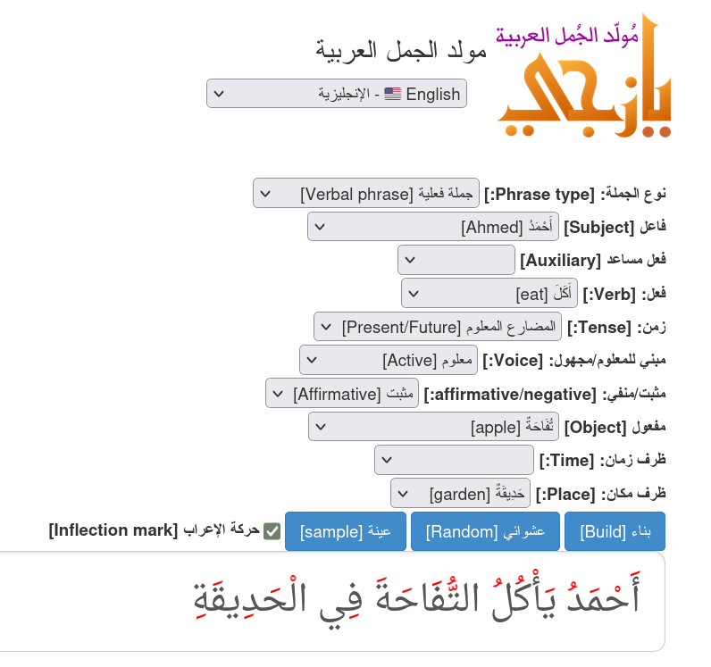

# **Yaziji**: Arabic Phrase generator

**Yaziji** is an advanced tool designed for generating grammatically correct Arabic phrases with full diacritics. It is primarily aimed at teaching Arabic to non-native speakers and supports multilingual localization. Yaziji offers a customizable phrase generator for various educational and linguistic applications.

- ## **يازجي**: مولد العبارات العربية

  **يازجي**:  مولد الجمل العربية، أداة متقدمة مصممة لتوليد الجمل عربية صحيحة نحويًا مشكولة بالكامل. تستهدف تعليم اللغة العربية للناطقين بغيرها وتدعم لغات متعددة. يقدم يازجي مولد جُمل قابلًا للتخصيص لمختلف التطبيقات التعليمية واللغوية.

  > **[تجربة على tahadz.com/yaziji](http://tahadz.com/yaziji)**


| **Feature** | **Value**                                                    |
| ----------- | ------------------------------------------------------------ |
| **Website** | [tahadz.com/yaziji](https://tahadz.com/yaziji)               |
| **Authors** | [Authors.md](https://github.com/linuxscout/yaziji/master/AUTHORS.md) |
| **Release** | 0.1                                                          |
| **License** | [GPL](https://github.com/linuxscout/yaziji/master/LICENSE)   |
| **Tracker** | [Issues](https://github.com/linuxscout/yaziji/issues)        |
| **Docs**    | [Documentation](https://github.com/linuxscout/yaziji/docs/)  |
| **Source**  | [GitHub](https://github.com/linuxscout/yaziji)               |
| **Credits** | [Credits](https://github.com/linuxscout/yaziji/CREDITS)      |

### **The Idea الفكرة**
<div dir="rtl"> 
  تطبيق ويب مصمم لمساعدة متعلمي اللغة العربية من الناطقين بغيرها على تركيب جمل بسيطة بناءً على مدخلات منمطة.
   على سبيل المثال:

  - **الفاعل**: أحمد
  - **الفعل**: أكل
  - **المفعول به**: تفاحة
  - **ظرف المكان**: حديقة

  **النتيجة**:
   **أَحْمَدُ يَأْكُلُ التُّفَاحَةَ فِي الْحَدِيقَةِ**
</div>

A web application designed to help non-native Arabic learners construct simple sentences based on structured inputs.
 For example:

- **Subject**: Ahmed
- **Verb**: ate
- **Object**: an apple
- **Time Adverb**: in the garden

**Result**:
 **أَحْمَدُ يَأْكُلُ التُّفَاحَةَ فِي الْحَدِيقَةِ**
 (Ahmed eats the apple in the garden).




------

## **Table of Contents**

1. [Features](#features)
2. [Getting Started](#getting-started)
3. [Project Structure](#project-structure)
4. [Usage Instructions](#usage-instructions)
5. [Contributing](#contributing)
6. [Future Enhancements](#future-enhancements)
7. [Name Meaning](#name-meaning)
8. [License](#license)

------
<div dir="rtl">

## **المزايا**

  - **مولد الجمل**: ينشئء عبارات عربية صحيحة نحويًا مشكولة بالكامل.
  - **اللغات**: يدعم عدة لغات، ليساعد الناطقين بغير العربية على تعلمها.
  - يتكون النظام من **نواة أساسية** لتوليد الجمل العربية و**طبقة ترجمة خارجية** تدعم لغات أخرى مثل ليابانية والإنجليزية.
  - **النواة الأساسية**: تعالج المدخلات الأساسية (مثل الفاعل، المفعول به، الفعل، الأفعال المساعدة، الزمن، المكان) لإنتاج جمل عربية مشكولة بالكامل.
  - **طبقة الترجمة**: تتيح للمتعلمين اختيار كلمات بلغتهم الأصلية التي تُترجم إلى العربية، ثم تُرسل للنواة لتوليد جملة صحيحة نحويًا.
  - **واجهة قابلة للتخصيص**: تتكيف مع لغة المتعلم، مع إمكانية تعديل بنية الجمل حسب اللغة مثل اليابانية أو الإنجليزية.

<div/>

## **Features**

- **Phrase Generator**: Constructs grammatically accurate Arabic phrases with full diacritics.
- **Localization**: Supports multiple languages, helping non-native speakers learn Arabic.

- The system consists of a **core module** for generating Arabic sentences and an **external translation layer** that supports other languages, including Japanese and English.
- **Core Module**: Processes essential inputs (e.g., subject, object, verb, auxiliary verb, tense, place, and time) to generate fully-formed, diacritized Arabic sentences.
- **Translation Layer**: Allows learners to select words in their native language, which are translated into Arabic and passed to the core module for sentence generation.
- **Customizable Interface**: Adapts to the learner's language, with customizable  structures for different languages such as Japanese or English.


------

## **Getting Started**

### **1. Set Up the Development Environment**

1. Clone the repository:

   ```bash
   git clone https://github.com/linuxscout/yaziji.git
   cd yaziji
   ```

2. Install the required dependencies:

   ```bash
   pip install -r requirements.txt
   ```

3. Configure the environment using files in the `config/` directory, if applicable.

### **2. Run the Application**

To start the server:

```bash
make server
```

Alternatively:

```bash
cd web
python3 yaziji_webserver.py
```

The server will run on `http://127.0.0.1:5000`.

------

## **Project Structure**

Yaziji consists of three main components: the **core module**, **web API**, and **frontend interface**.
 Key directories include:

- **`yaziji/`**: Core logic for phrase generation.
- **`data-source/`**: Raw data and feature definitions.
- **`web/`**: Web API built with Flask.
- **`web-frontend/`**: Frontend interface connected to the web API.
- **`tools/`**: Scripts for data conversion and translation management.
- **`translations/`**: Language translation files.
- **`tests/`**: Unit tests for system validation.

------

## **Usage Instructions**

### **1. Adding a New Language**

Refer to the Translation Guide for steps to add and manage new languages.

### **2. Customizing the Interface**

Modify the following directories to customize the user interface:

- **Frontend**: `web-frontend/`
- **Static Resources**: `static/`

### **3. Testing**

Run the test suite to validate the system:

```bash
python -m unittest discover -s tests
```

Debug issues using logs stored in the `logs/` directory.

------

## **Contributing**

We welcome contributions from the community!

1. Fork the repository.

2. Create a feature branch:

   ```bash
   git checkout -b feature-name
   ```

3. Make changes and commit:

   ```bash
   git commit -m "Add feature-name"
   ```

4. Push to your fork and create a pull request.

For more details, see the Development Documentation.

------

## **Name Meaning**

The name **Yaziji** (Arabic: يازجي) is derived from Turkish origins and means "clerk" or "writer." Variations include **Yazigi** and **Yazji**.

Notable figures with this surname include:

- **Ibrahim al-Yaziji** – Lebanese philologist.
- **Nasif al-Yaziji** – Lebanese author.
- **Zina Yazji** – Syrian journalist.

------

## **Future Enhancements**

- Add support for more languages.
- Optimize database performance for faster phrase generation.
- Enhance the UI for improved accessibility and engagement.

------

## **License**

This project is licensed under the GNU GPL License.