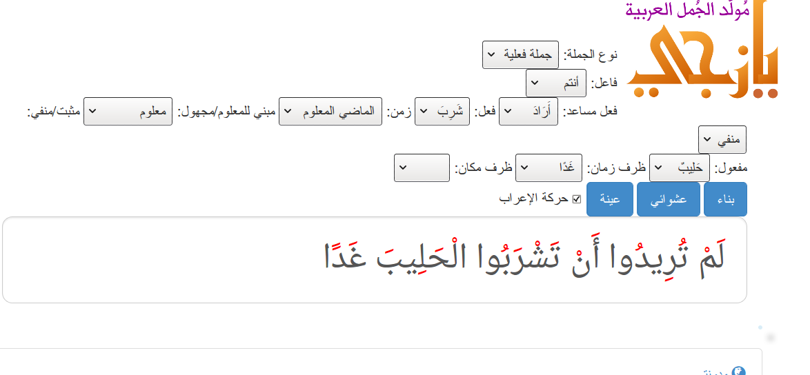

# مولد الجمل العربية

Created الاثنين 06 يوليو 2020

# الفكرة

موقع أو تطبيق يساعد المتعلم للعربية غير الناطق بها لتركيب جمل بسيطة بالاعتماد على مدخلات نمطية  
مثلا:  
الضمير: أنا  
الفعل : ذهب  
المفعول به: السوق  
ظرف الزمان: غدا

النتيجة : سَأُذْهِبُ إِلَى السُّوقِ غَدَا

## النظام

للنظام نواة لتوليد الجمل العربية وطبقة خارجية للترجمة من لغات أخرى، على رأسها اليابانية والإنجليزية

## النواة

تستقبل المدخلات الضرورية (الفاعل، المفعول، الفعل، الفعل المساعد، الزمن، المكان والزمان...)  
وتخرج جملة مصوغة مشكولة.

### الواجهة

حاليا نصمم واجهة وب، ويمكن مستقبلا إضافة تطبيق هاتف ذكي

### طبقة الترجمة

تسمح للطالب أن يختار كلمات بلغته وتترجم إلى العربية كلمة كلمة، ثم تدخل للنواة التي تصوغ الجملة صياغة سليمة.

- يمكن أن تعدّل الواجهة حسب اللغة المترجمة، يعني ما يظهر للياباني غير ما يظهر للإنجليزي لأن بنية الجملة مختلفة في اللغتين.

## الجمهور المستهدف

المبتدئون في تعلم العربية من الناطقين بغيرها

## البيانات

نحتاج إلى قوائم كلمات محدودة تتلاءم مع مستوى المبتدئ في اللغة، و يمكن إثراؤها لاحقا.

- الفاعل/ المبتدأ: معلوماته
  - نوعه (مذكر/مؤنث)
  - عدده (مفرد، مثنى، جمع): "والدان مثنى"
  - معرفة/نكرة
  - يجمع جمعا سالما
  - يجمع جمع تكسير
  - منقوص/مقصور
  - ممنوع من الصرف
- الفعل المساعد مثل استطاع، كاد، أمكن، أراد، وجب، انبغى
- الفعل الأساسي في الجملة: مثل شرب، ضرب، لعب، سار إلى، توجه إلى،
  - معلومات عن الفعل: لازم، متعد، متعد بحرف،
  - حرف التعدي للمتعدي بحرف
  - عدد المفعولات (لازم، متعد لمفعول واحد، متعد لمفعولين)
  - هل يقبل التعدي للعاقل، مثل شرب لا يتعدى لعاقل: لذا لا يقبل صيغة مثل شربتهما.
  - هل يتعدى إلى فاعله (فعل قلبي)، مثلا " أنا وجدْتُني مرتاحا".
  - حركة عين المضارع للفعل الثلاثي
  - ملاحظة: هذه المعلومات لا تظهر كلها للمستخدم، بل حين يختار فعلا، تدخل هذه المعلومات الإضافية للبرنامج.
- المفعول به، ويحتاج إلى ضبط ليتلاءم مع الفعل
- الزمان: ظروف الزمان مثل صباحا مساء، كل يوم، دائما، أحيانا،
- المكان: سوق، مدرسة، مسجد، ملعب

يمكن إضافة: بعض التراكيب للجمل

- جملة اسمية بسيطة: اسم خبر
- جملة اسمية مركبة: اسم و خبر شبه جملة أو جملة فعلية
- جملة فعلية بسيطة: فعل فاعل مفعول به، مكان وزمان
- جملة فعلية مركبة: فعل مساعد فاعل فعل ومفعول به ومكان وزمان
- جملة فعلية لفعل يتعدى لمفعولين
- جملة شرطية: إن تدرس تنجح
- جملتان فعليتان: خرجت بعد أن تعافيت

### العلاقة الدلالية بين الفعل والفاعل والمفعول

للحصول على جملة مفيدة صحيحة، يستحسن أن نحصر العلاقات بين الفعل وفاعله والفعل ومفعوله  
فلا يصح أن نقول : أنا شربت الطاولة، وأيضا (أنا) شربتهما  
لذا نحتاج إلى بيانات أكثر عن المفعولات المقبولة لكل فعل  
وتكون العلاقة فاعلية أو مفعولية. مثلا:

- (اصطاد، السمك، فاعلية) لأن السمك يَصطاد
- (اصطاد، السمك، مفعولية) لأن السمك يُصطاد.
- (شرب، الحليب، مفعولية) لأن الحليب يُشرب ولا يّشرب.

## شكل البيانات المطلوب العمل عليها

يمكن استخلاص بيانات الكلمات من القاموس — الراموز — المتوفر رقميا-- لدينا،  
لذا سيقتصر تزويدنا بالآتي في قوائم منفصلة

- الفاعل/ المبتدأ:
  - يكون نكرة مشكولا، وينتهي بتنوين الرفع إن أمكن مثل سَعِيدٌ، سَلْمَى
  - يمكن إضافة معلومة إن كان اسم علم
- الفعل المساعد مثل استطاع، كاد، أمكن، أراد، وجب، انبغى
- الفعل الأساسي في الجملة:
  - يكون مشكولا في الماضي المعلوم مع هو
  - مثل شرب، ضرب، لعب، سار إلى، توجه إلى،
  - حرف التعدي إن كان متعديا بحرف
  - حركة عين المضارع للثلاثي فقط إذا كان له شكل آخر،
    - مثلا (ضَرَبَ، كسرة) لأن هناك أشكال أخرى ضرب يضرُب
- المفعول به، ويحتاج إلى ضبط ليتلاءم مع الفعل
- الزمان: ظروف الزمان مثل صباحا مساء، كل يوم، دائما، أحيانا،
  - يحتاج إلى توضيح زمن التصريف، بعد غد (مستقبل = مضارع مع سين الاستقبال)
  - بعض الظروف لا توضح الزمن مثل ( ذهبت اليوم وأذهب اليوم).
- المكان: سوق، مدرسة، مسجد، ملعب

#### البيانات الدلالية

كيفية صياغتها، تكون في ثلاثية:  
الفعل، الاسم، نوع العلاقة

- (اصطاد، السمك، فاعلية)
- (اصطاد، السمك، مفعولية)
- (شرب، الحليب، مفعولية)

يتكرر الفعل بعدد فاعليه أو مفعوليه

### فحص المدخلات

نفحص المدخلات في مرحلتين: دون معالجة، وبعد المعالجة

###  1- فحص المدخلات الخام:

​               أي نفحصها قبل أي إضافة أو معالجة ، ونمنع ما يمنع الجملة المفيدة:

في هذه المرحلة لا نعالج الحالات التي تحتاج إلى خصائص إضافية للكلمة، مثل التعدي واللزوم للفعل، والتذكير والتأنيت والعدد للاسم

وهنا لدينا الحالات المانعة من بناء الجملة: (ترجع خطأ، ورسالة توضيح)

- جملة اسمية بلا اسم ( المبتدأ يمكن أن يكون فاعلا أو مفعول به)

  مثال خاطئ:  فاعل:""، مفعول:""

- جملة فعلية بلا فعل، مثال فعل:''

- فعل بلا فاعل ولا مفعول

- جملة فعلها مبنية للمجهول بلا نائب فاعل (مفعول به)

  مثال: فعل: ضرب، مبني: مجهول، مفعول:""

* فعل مبني للمعلوم بلا فاعل

  مثال: فعل: ضرب، فاعل: ""

- فعل أمر  بلا ضمير مخاطب

  مثال : زمن: أمر، فاعل: أحمد، نعتمد فقط على كون الكلمة لا تبدأ بحروف "أنت"

والحالات التي فيها أقل مكونات للجملة : تتحقق أن الجملة تحوي على الأقل هذه المكونات، لمتابعة العمل، ترجع صح،

إذا لا تحوي هذه الجملة أقل ما يمكن، ترجع خطأ

- فعل وفاعل، مثال  (رجع الولد)

  هنا لا نهتم بكون الفعل متعديا أولا، لأننا نقتصر على فحص أن الجملة فيها على الأقل فعل وفاعل

- فعل مفعول به وزمن مبني للمجهول لا يكون أمرًا  مثال: (أكُل الطعام)

- مبتدأ (فاعل) خبر (صفة) ، مثال:  الولد جميل

- مبتدأ مكان أو جار ومجرور، مثال: الولد في البيت

### فحص المدخلات حسب خصائصها

في هذه المرحلة نستخلص خصائص الكلمات من القاموس، ثم نفحص صلاحيتها في التركيب.

نفحص هذه الأمور هنا، لأن المدخلات السابقة تكون خامًا، ليس فيها معلومات عن الكلمات،

لكن في هذه المرحلة، استخلصنا خصائص الكلمات، مثل التعدي واللزوم للفعل، والنوع والعدد والتعريف للأسماء.

نفحص فيها جانب التركيب وجانب الدلالة،

في جانب التركيب: نمنع بعض الحالات الخاطئة مثل:

* فعل لازم بمفعول به

* فعل لازم مبني للمجهول

* فعل متعدٍ بلا مفعول به

* فعل متعد بحرف بلا مفعول به

* ضمير غير مخاطب مع الأمر،
  استخلصنا هذه الحالة في فحص المدخلات الخام، لكن هنا نحصل على الضمير المقابل للكلمة، الولد=> هو، البنت هي، الولدان: هما، لذا يستحسن فحصها ثانية.

* ظرف زمان في زمن غير مناسب،
  مثال: غدًا، زمن ماضي، مثبت (خطأ)
  البارحة، زمن مضارع مجزوم (صحيح)

  غدا، زمن مضارع مجزوم (خطأ)

  

في الجانب الدلالي: نفحص ربط الكلمات دلاليا

* فعل وفاعل، 

  مثال: أكل الولد، ممكن، أكلت الطاولة(فاعل)، غير ممكن

* فعل ومفعول به،

   مثال: أكل الولد الطعام، ممكن، أكل الولد الطاولة(مفعول)، غير ممكن
